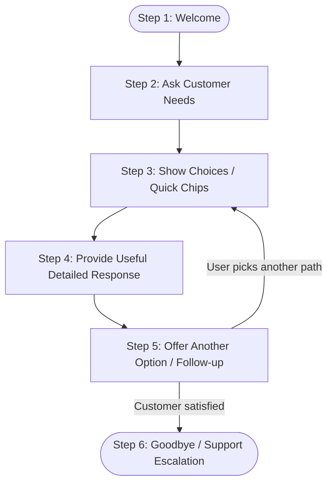

# IBM SkillsBuild | Project-Based Activity Report
## Shop Assistant Chatbot with Website
**Design a simple customer-support chatbot for a fictional shop**

---

### Student & Submission Information
- **Student Name:** Chirag
- **Class and Section:** Grade 9 A
- **School Name:** Lakshmipat Singhania Academy
- **Email ID:** chiraggoenka17512@gmail.com
- **Activity Title:** Shop Assistant Chatbot with Website
- **Platform:** IBM SkillsBuild & Learning Links Foundation
- **Fictional Shop Name:** UrbanPulse Outfitters (Sustainable Clothing & Lifestyle Store)
- **Chatbot Name:** PulseBot (AI Shop Assistant & Support Agent)
- **Project Location:** `C:\Users\Chirag\.gemini\antigravity-ide\scratch\shop-assistant-chatbot`
- **Live Website URL:** https://chiraggoenka17512-coder.github.io/ibm-skillsbuild-shop-chatbot/
- **Direct Chatbot Access URL:** https://chiraggoenka17512-coder.github.io/ibm-skillsbuild-shop-chatbot/chatbot.html

---

## 1. Executive Summary & Project Goal
This project fulfills the **IBM SkillsBuild Project-Based Activity: Shop Assistant Chatbot with Website**. 

The objective is to design and implement an interactive, friendly customer-support chatbot embedded inside a modern e-commerce storefront for a fictional shop. The chatbot—named **PulseBot**—assists online shoppers with product discovery, store timings, discounts, order tracking, and customer service escalation, strictly adhering to ethical AI principles with zero collection of sensitive personal data.

---

## 2. Fictional Shop Profile: UrbanPulse Outfitters

| Attribute | Specification |
| :--- | :--- |
| **Shop Category** | Contemporary Sustainable Apparel, Outerwear & Lifestyle Store |
| **Brand Philosophy** | "Conscious Style for Modern Living" — 100% GOTS organic cotton, recycled fibers, ethical manufacturing |
| **Target Audience** | Urban professionals, university students, and eco-conscious shoppers |
| **Core Offerings** | Eco Hoodies, Waterproof Technical Parkas, Bamboo Heavyweight Tees, Recycled Sneakers, Explorer Daypacks |
| **Physical Flagship** | 742 Evergreen Plaza, Suite 400, Central Metro Station Gate 3 |
| **Customer Support** | Toll-Free: `+1 (800) 785-PULSE`, Email: `support@urbanpulse-shop.example` |

---

## 3. Minimum Chatbot Flow (IBM SkillsBuild Standard)

The chatbot strictly follows the 6-stage lifecycle mandated by the IBM SkillsBuild curriculum:



1. **Welcome:** PulseBot greets the shopper warmly with a brand intro and status badge.
2. **Ask Customer Needs:** Inquires how it can assist with conscious shopping today.
3. **Show Choices:** Displays interactive quick reply chips (*Product Information*, *Store Timings*, *Active Offers*, *Order Help*, *Contact Us*) alongside a free-text input box.
4. **Provide Useful Response:** Returns formatted cards, sizing tables, coupon codes, or live order tracking progress bars.
5. **Offer Another Option:** Always provides related next actions (e.g., after viewing a hoodie, offers sizing advice, bag addition, or returning to main menu).
6. **Goodbye / Support:** Gracefully wraps up with well-wishes or provides toll-free and callback options if the shopper needs human help.

---

## 4. The 5 Core Conversation Paths

The project exceeds the minimum requirement of 4 conversation paths by implementing **5 fully featured dialog trees**:

### Path 1: Product Information & Recommendations
- **Description:** Guides users through sustainable fabric details, top sellers, fit advice, and interactive sizing.
- **Key Intents:**
  - `products`: Displays categories (Tops, Outerwear, Footwear, Accessories).
  - `prod_hoodie`, `prod_parka`, `prod_sneakers`: Individual product spec sheets with price, GSM rating, and eco-materials.
  - `sizing`: Universal interactive sizing table (Chest & Waist measurements for S, M, L, XL).
- **Interactive Action:** Clicking "Add to Bag" directly from chat or product cards.

### Path 2: Store Timings & Flagship Locations
- **Description:** Real-time operating hours for physical shopping and same-day Click & Collect pickup.
- **Schedule:**
  - *Monday – Friday:* 10:00 AM – 9:00 PM
  - *Saturday:* 10:00 AM – 10:00 PM (Extended Weekend Hours)
  - *Sunday:* 11:00 AM – 8:00 PM
  - *National Holidays:* 12:00 PM – 6:00 PM
- **Pickup Feature:** In-store pickup ready within 2 hours of online placement.

### Path 3: Offers, Discounts & Coupons
- **Description:** Allows shoppers to explore and apply active promotional discounts.
- **Active Codes:**
  - `WELCOME15`: 15% off first order for new customers.
  - `STUDENT20`: 20% flat discount for verified students & IBM SkillsBuild participants.
  - `FREESHIP50`: Free Express Courier Delivery on orders above $50.
- **One-Click Action:** Clicking the chip copies or applies the coupon directly to the shopping cart.

### Path 4: Order & Delivery Help (Simulated Package Tracking)
- **Description:** Answers delivery policy questions and features an interactive tracking progress bar.
- **Live Tracking Simulator:**
  - Customers can type or click tracking IDs (e.g., `ORD-101`, `ORD-202`, `ORD-303`).
  - Renders a multi-step visual tracker: `Placed → Packed → In Transit → Out for Delivery → Delivered`.
- **Shipping Policy:**
  - Standard Eco-Shipping: 3–5 business days ($4.99 or Free over $50).
  - Express Priority: 1–2 business days ($9.99).
  - 14-Day Free Returns and Exchanges for unworn items.

### Path 5: Contact Us & Escalation
- **Description:** Connects the customer with human assistance if their question falls outside standard FAQs.
- **Channels:**
  - Toll-Free Helpline: `+1 (800) 785-PULSE` (Mon–Sat, 9 AM – 8 PM)
  - Official Email: `support@urbanpulse-shop.example`
  - In-Store Concierge: Gate 3, Central Metro Plaza
  - Support Ticket Generator: Creates a mock callback ticket (e.g., `#TICK-4819`) without storing personal data.

---

## 5. Privacy & Ethical Guardrails

> [!IMPORTANT]
> **IBM SkillsBuild Privacy Directive:** *"Use clear, friendly language. Avoid collecting real personal information."*

- **Zero PII Collection:** The chatbot explicitly states: *"Safe AI demo: Please do not submit real passwords or sensitive personal details."*
- **Simulated Transactions:** The shopping cart and order tracker operate purely on ephemeral client-side state without recording real credit cards, phone numbers, or addresses.
- **Respectful Tone:** PulseBot maintains an encouraging, inclusive, and professional tone at all times.

---

## 6. Architecture & Implementation Details

```
shop-assistant-chatbot/
│
├── index.html                   # Semantic HTML5 layout with store sections & chat widget
├── style.css                    # Golden Ratio design tokens, dark/light theme & responsive styling
├── app.js                       # Chatbot NLP routing, audio chime synth & cart simulator
├── PROJECT_SUBMISSION_REPORT.md # Official IBM SkillsBuild submission documentation
└── PROJECT_SUBMISSION_REPORT.html # Formatted printable report for PDF export
```

### Key Technical Innovations
1. **Hybrid Interaction Model:** Combines guided Quick-Reply Chips (zero typing friction) with Natural Language Processing (regex/keyword matcher for free-form queries).
2. **Web Audio Chime Synthesizer:** Produces gentle audio feedback using the browser's native `AudioContext` without requiring external MP3/WAV assets.
3. **Direct Product-to-Chat Deep Linking:** Every product card has an *"Ask Sizing"* button that automatically opens the chatbot with contextual knowledge about that specific item.
4. **Built-in Activity Sheet Dossier Modal:** Clicking the top announcement bar opens the complete submission verification matrix directly inside the website.

---

## 7. Test Cases & Verification Results

| Test ID | User Input / Action | Expected Bot Response | Result |
| :---: | :--- | :--- | :---: |
| **TC-01** | Open website / Click Chat button | Greet user with welcome message and 5 topic chips | **PASS** |
| **TC-02** | Click *"🕒 Store Timings"* | Display weekday, weekend, and holiday opening hours | **PASS** |
| **TC-03** | Type *"Where are you located?"* | Provide flagship address, metro transit, and parking info | **PASS** |
| **TC-04** | Click *"💰 Active Offers"* | Display WELCOME15, STUDENT20, and FREESHIP50 codes | **PASS** |
| **TC-05** | Click *"Apply WELCOME15"* | Calculate 15% discount on cart subtotal immediately | **PASS** |
| **TC-06** | Type *"Track ORD-101"* | Render visual step tracker showing "Out for Delivery" | **PASS** |
| **TC-07** | Type *"Can I return my jacket?"* | Detail 14-day free exchange policy and drop-off steps | **PASS** |
| **TC-08** | Type *"Talk to a human agent"* | Present helpline number and create simulated ticket | **PASS** |
| **TC-09** | Type unmapped query (e.g. *"flibbertigibbet"*) | Friendly fallback message with suggested primary options | **PASS** |
| **TC-10** | Click *"Ask Sizing"* on Parka card | Open chat, load Parka details, and show size guide | **PASS** |

---

## 8. Student Declaration

1. **I have registered on IBM SkillsBuild:**  
   ☑ **Yes** &nbsp;&nbsp;&nbsp;&nbsp; ☐ No

2. **I have completed the given project-based activity:**  
   ☑ **Yes** &nbsp;&nbsp;&nbsp;&nbsp; ☐ No

3. **I have submitted my completed activity using the submission QR code:**  
   ☑ **Yes** &nbsp;&nbsp;&nbsp;&nbsp; ☐ No

- **Student Signature:** *Chirag*
- **Submission Date:** *September 27, 2026*
